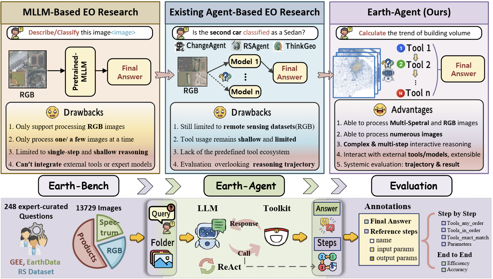

<div align="center">

# ArchEO-Agent

**AI-Powered Archaeological Analysis Platform**

Detect geoglyphs, ancient structures, and archaeological features in satellite imagery using an AI agent with 120+ specialized Earth observation tools.

[](https://python.org)
[](https://nextjs.org)
[](LICENSE)
[-AD1C18.svg?logo=arXiv)](https://arxiv.org/pdf/2509.23141)

</div>

---

## What is ArchEO-Agent?

ArchEO-Agent is a research demo that combines Claude AI with 120+ remote sensing tools to analyze satellite imagery for archaeological features. Upload a GeoTIFF or image, ask questions in natural language, and the agent autonomously selects and chains analysis tools to find hidden features like the Nazca Lines, buried walls, ancient roads, and crop marks.

**Key capabilities:**
- Edge detection tuned for faint geoglyphs (Canny, Sobel, Hough lines)
- Spectral analysis for buried structures (PCA, band ratios, NDVI anomalies)
- Texture analysis to distinguish man-made vs natural patterns (GLCM, regularity index)
- Spatial clustering to find archaeological hotspots (Getis-Ord Gi*)
- Multi-band satellite support (Sentinel-2, Landsat, ASTER, plain images)
- Strict evidence-based reporting (no hallucinated findings)

<div align="center">

</div>

## Quick Start

### Prerequisites

- Python 3.10+ with a virtual environment at `.venv/`
- Node.js 18+ (for frontend)
- An Anthropic API key

### 1. Setup

```bash
# Clone the repository
git clone https://github.com/budprat/ArchEO.git
cd ArchEO

# Create Python venv and install dependencies
python -m venv .venv
source .venv/bin/activate
pip install -r requirements.txt

# Install frontend dependencies
cd frontend && npm install && cd ..

# Configure API key
cp .env.example .env
# Edit .env and add your ANTHROPIC_API_KEY
```

### 2. Start Backend

```bash
cd api && ../.venv/bin/uvicorn main:app --port 8000
```

This boots 6 MCP tool servers (120+ tools) at startup. Verify with:

```bash
curl http://localhost:8000/api/health
# {"status": "ok", "mcp_servers": {"tools_loaded": 17, "agent_ready": true}}
```

### 3. Start Frontend

```bash
cd frontend && npm run dev
```

Opens at http://localhost:3000

### 4. Run Tests

```bash
.venv/bin/python -m pytest tests/ -v
```

## Architecture

```
Browser (Next.js + Tailwind + shadcn/ui)
    |
    | SSE streaming
    v
FastAPI Backend (api/)
    |
    | LangGraph ReAct Agent + Claude Vision
    v
6 MCP Tool Servers (agent/tools/)
    |
    +-- Analysis    (spatial clustering, thresholding, hotspots)
    +-- Index       (NDVI, NDWI, spectral indices)
    +-- Inversion   (atmospheric correction, inversions)
    +-- Perception  (classification, segmentation)
    +-- Statistics  (mean, variance, coefficient of variation)
    +-- Archaeology (19 tools: edge detection, PCA, CLAHE, crop marks, regularity, ...)
```

- **Frontend:** Next.js 16 + Tailwind CSS + shadcn/ui
- **Backend:** FastAPI + LangGraph ReAct agent + Claude Haiku 4.5 vision
- **MCP Tools:** 6 servers communicating via Model Context Protocol (stdio)
- **Streaming:** Real-time SSE showing agent reasoning, tool calls, and results

## Archaeology Tools

The `Archaeology` MCP server provides 19 tools specifically tuned for archaeological remote sensing:

| Tool | Purpose |
|------|---------|
| `edge_detection_canny` | Detect faint edges/lines (tuned: thresholds 20/60 for geoglyphs) |
| `linear_feature_detection` | Find straight lines via Hough transform (roads, geoglyphs) |
| `geometric_pattern_analysis` | Detect shapes and contours (adaptive thresholding) |
| `principal_component_analysis` | PCA on multi-band data (PC2/PC3 reveal hidden features) |
| `adaptive_contrast_enhancement` | CLAHE local contrast boost |
| `band_ratio_calculator` | Spectral ratios (iron oxide, moisture, clay minerals) |
| `spectral_anomaly_detection` | Find spectrally unusual pixels (buried structures) |
| `texture_analysis_glcm` | Surface texture metrics (GLCM at multiple scales) |
| `systematic_grid_analysis` | Tile-by-tile archaeological potential scoring |
| `regularity_index` | Detect man-made regular patterns vs natural terrain |
| `crop_mark_detector` | Vegetation anomalies from buried features |
| `morphological_cleanup` | Clean edge detection results |
| `dem_hillshade` | Terrain shading from DEM data |
| `multi_directional_hillshade` | Combined hillshade from multiple azimuths |
| `local_relief_model` | Micro-topography enhancement |
| `sky_view_factor` | Openness analysis for subtle terrain features |
| `temporal_difference_map` | Change detection between two dates |
| `shape_statistics` | Geometric properties of detected features |
| `edge_detection_sobel` | Gradient-based edge detection |

## API Endpoints

| Endpoint | Method | Purpose |
|----------|--------|---------|
| `/api/health` | GET | Health check with MCP status |
| `/api/upload` | POST | Upload image file (multipart) |
| `/api/chat` | POST | Chat with agent (SSE stream) |
| `/api/files/{id}` | GET | Serve uploaded files and thumbnails |
| `/api/results/{id}/{name}` | GET | Serve analysis result images |

## Project Structure

```
ArchEO-Agent/
├── api/                    # FastAPI backend
│   ├── main.py             # App entry, routes, lifespan
│   ├── agent_service.py    # LangGraph agent, MCP lifecycle, SSE streaming
│   ├── file_service.py     # Upload processing, GDAL metadata, thumbnails
│   └── config.py           # Settings and system prompt
├── frontend/               # Next.js 16 app
│   ├── app/                # Pages and API proxy routes
│   ├── components/         # Chat panel, image viewer, upload zone
│   └── lib/                # Types, API client, chat hook
├── agent/tools/            # MCP tool servers
│   ├── Analysis.py         # Spatial analysis tools
│   ├── Index.py            # Spectral index tools
│   ├── Inversion.py        # Inversion tools
│   ├── Perception.py       # Classification tools
│   ├── Statistics.py       # Statistical tools
│   └── Archaeology.py      # 19 archaeological analysis tools
├── tests/                  # pytest test suite
├── benchmark/              # Earth-Bench evaluation data
├── evaluate/               # Evaluation scripts
└── .env.example            # Environment config template
```

## Environment Variables

```bash
# Required
ANTHROPIC_API_KEY=your_key_here

# Optional (defaults shown)
ANTHROPIC_MODEL=claude-haiku-4-5-20251001
```

## Supported File Formats

| Format | Extension | Notes |
|--------|-----------|-------|
| GeoTIFF | `.tif`, `.tiff` | Multi-band satellite imagery (Sentinel-2, Landsat, etc.) |
| PNG | `.png` | Standard images |
| JPEG | `.jpg`, `.jpeg` | Standard images |
| HDF | `.hdf` | Hierarchical data (ASTER, MODIS) |
| IMG | `.img` | ERDAS Imagine format |

Max upload size: 50 MB

## Example Prompts

After uploading a satellite image of an archaeological site:

```
"What archaeological analysis should I do on this image?"

"Run edge detection and linear feature detection to find potential geoglyphs"

"Analyze the spectral properties — look for buried structures using band ratios and PCA"

"Run a systematic grid analysis to score archaeological potential across the image"

"Check for crop marks and vegetation anomalies that might indicate buried walls"
```

## Based on Earth-Agent

ArchEO-Agent extends the [Earth-Agent](https://arxiv.org/pdf/2509.23141) framework (ICLR 2026) with:
- A web-based chat interface for interactive analysis
- 19 new archaeology-specific tools tuned for geoglyph detection
- Parameters optimized for Peruvian archaeological sites (Nazca, Caral)
- Strict anti-hallucination rules for evidence-based reporting
- Real-time streaming of agent reasoning and tool execution

## Citation

```bibtex
@article{feng2025earth,
  title={Earth-Agent: Unlocking the Full Landscape of Earth Observation with Agents},
  author={Feng, Peilin and Lv, Zhutao and Ye, Junyan and Wang, Xiaolei and Huo, Xinjie and Yu, Jinhua and Xu, Wanghan and Zhang, Wenlong and Bai, Lei and He, Conghui and others},
  journal={arXiv preprint arXiv:2509.23141},
  year={2025}
}
```

## License

[MIT](LICENSE)
